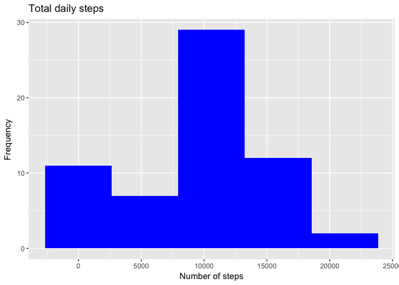
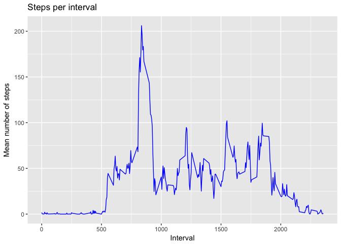
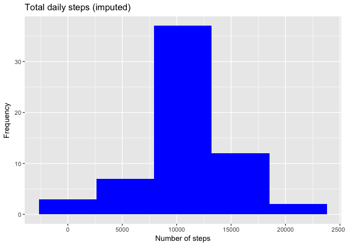
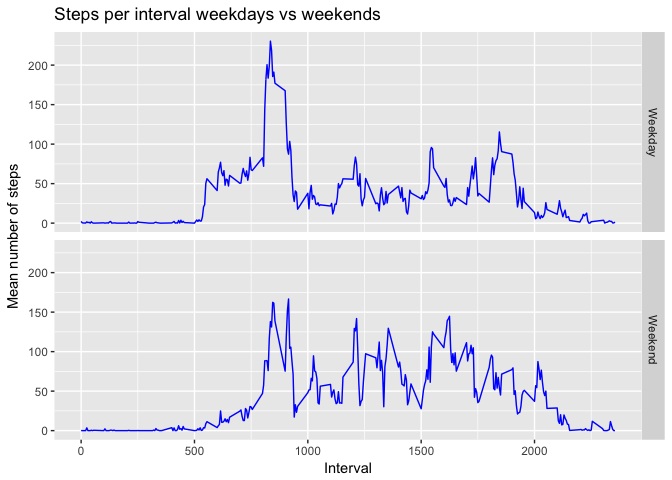

## Loading and preprocessing the data

```r
# load packages
library(data.table, quietly = TRUE)
library(ggplot2, quietly = TRUE)
# unzip data if activity.csv does not exists.
if(!file.exists("activity.csv")) unzip("activity.zip")
# load data
activity <- fread("activity.csv", na.strings="NA")
```
## What is mean total number of steps taken per day?
1. Make a histogram of the total number of steps taken each day
2. Calculate and report the mean and median total number of steps taken per day 

```r
#Sum amount of steps according to date.
totals <-activity[,.(sum = sum(steps, na.rm = TRUE)), by = date]

ggplot(data = totals, aes(x=sum)) +
    geom_histogram(bins = 5, fill = I("blue"))+
    labs(title = "Total daily steps", x = "Number of steps", y = "Frequency")
```

<!-- -->

```r
totalmean <- mean(totals$sum)
totalmedian <- median(totals$sum)
```
The mean total steps are 9354.23
and the median total steps are 10395.

## What is the average daily activity pattern?
1. Make a time series plot of the 5-minute interval (x-axis) and the average 
number of steps taken, averaged across all days (y-axis)  
2. Which 5-minute interval, on average across all the days in the dataset, 
contains the maximum number of steps?  

```r
#Calculate mean steps per interval for both factors
interval.steps <- activity[,.(meanst = mean(steps, na.rm = TRUE)), 
                           by = interval]

ggplot(interval.steps, aes(x = interval, y = meanst))+
    geom_line(color = "blue")+
    labs(title = "Steps per interval", x = "Interval", 
         y = "Mean number of steps")
```

<!-- -->

```r
maxsteps <- interval.steps[which.max(meanst), interval]
```

The interval 835 contains the maximum number of steps.

## Imputing missing values
1. Calculate and report the total number of missing values in the dataset
(i.e. the total number of rows with NAs)  
2. Devise a strategy for filling in all of the missing values in the dataset. 
The strategy does not need to be sophisticated. For example, you could use the 
mean/median for that day, or the mean for that 5-minute interval, etc.  
3. Create a new dataset that is equal to the original dataset but with the 
missing data filled in.
4. Make a histogram of the total number of steps taken each day and Calculate 
and report the mean and median total number of steps taken per day. Do these 
values differ from the estimates from the first part of the assignment? What is 
the impact of imputing missing data on the estimates of the total daily number 
of steps?


```r
activity.imputed <- activity[, missingvalue := is.na(steps)]
amount.missing <- activity[,sum(missingvalue)]
```
The amount of missing values are 2304.  


```r
# Create function to look up the average amount of steps for a specific interval
impute.missing <- function(missing.interval) {
    interval.steps[interval %in% missing.interval, as.integer(meanst)]}

activity.imputed[missingvalue == TRUE, steps := impute.missing(interval)]
```

Missing values are imputed by looking up the average amount of steps for that
specific interval, transforming to a interger value and using this to impute the
missing value.


```r
#Sum amount of steps according to date.
totals.imputed <- activity.imputed[,.(sum = sum(steps, na.rm = TRUE)), 
                                   by = date]

ggplot(data = totals.imputed
       , aes(x=sum)) +
    geom_histogram(bins = 5, fill = I("blue"))+
    labs(title = "Total daily steps (imputed)", x = "Number of steps", 
         y = "Frequency")
```

<!-- -->

```r
totalimmean <- mean(totals.imputed$sum)
totalimmedian <- median(totals.imputed$sum)
diffmean <- totalimmean - totalmean
diffmnedian <- totalimmedian - totalmedian
```

The mean total steps are, after imputing missing values, 
10749.77
and the median total steps are 
10641.  
For the mean this is a difference of 
1395.54 
steps per day and for the median it was 
246 steps per day.

## Are there differences in activity patterns between weekdays and weekends?
1. Create a new factor variable in the dataset with two levels – “weekday” and 
“weekend” indicating whether a given date is a weekday or weekend day.
2. Make a panel plot containing a time series plot (i.e. type = "l") of the 
5-minute interval (x-axis) and the average number of steps taken, averaged 
across all weekday days or weekend days (y-axis). The plot should look something
like the following, which was creating using simulated data:

```r
#Change locale to ensure correct language
systemtime <- Sys.getlocale(category = "LC_TIME")
invisible(Sys.setlocale("LC_TIME", "en_GB.UTF-8"))
#Create vector of weekdas to test against.
weekdays <- c("Monday", "Tuesday", "Wednesday", "Thursday", "Friday")
#Create a factor weekday.var
activity.imputed[, weekday.var := as.factor(ifelse(weekdays(as.Date(date)) %in%
                                                  weekdays,"Weekday","Weekend"))]
#Calculate mean steps per interval for both factors
interval.week <- activity.imputed[,.(meanst = mean(steps, na.rm = TRUE)),
                         by = .(interval, weekday.var)]

#Create line plot, with a faceting for the factor weekday.var
ggplot(interval.week, aes(x = interval, y = meanst))+
    geom_line(color = "blue")+
    labs(title = "Steps per interval weekdays vs weekends",
         x = "Interval", y = "Mean number of steps")+
    facet_grid(weekday.var~.)
```

<!-- -->

```r
#Change locale to previous setting
invisible(Sys.setlocale("LC_TIME", systemtime))
```
